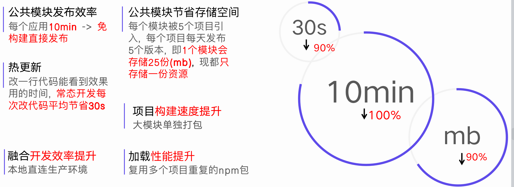
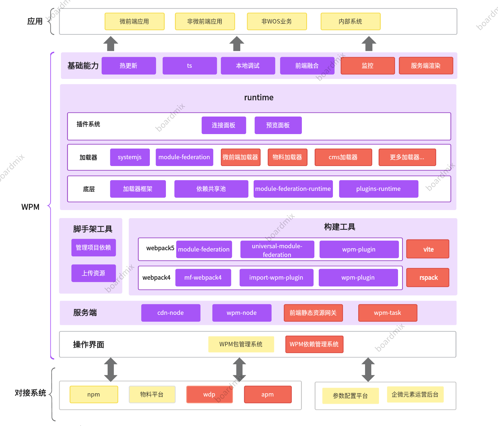

# 关于WPM.JS

## 概述

WPM（Web Package Manager）是一个微前端包管理平台, 项目中可以通过接入WPM来引入远程包使用, 它允许在多个应用程序之间高效地共享代码，从而显著减少代码重复和维护成本

<a href="http://wpmjs.show.hsmob.com/about/" target="_blank">了解更多</a>

## 价值

## 架构

## 使用示例
> 开源底层实现, 可与前端生态相结合, 更容易扩展支持未来的升级
> - 使用universal-module-federation (opens new window)实现, 能够支持webpack4 (opens new window)、5
> - WPM包作为标准module-federation (opens new window)模块输出, 可以被ModuleFederationPlugin引入
> - 非webpack项目可以用vite (opens new window)的方式使用WPM包

## 功能对比
| 
功能
 | 
WPM
    | 
NPM
    |
| :---------------------------------: | :--------------------------------------- | :--------------------------------------- |
|         功能1                      | 支持                      | 不支持 |
|         功能2                    | 不支持                      |不支持 |
|         功能3                    | 支持                        |支持 |
|         功能4                      | 支持                      |不支持 |
|         功能5                    | 支持                        |支持 |
